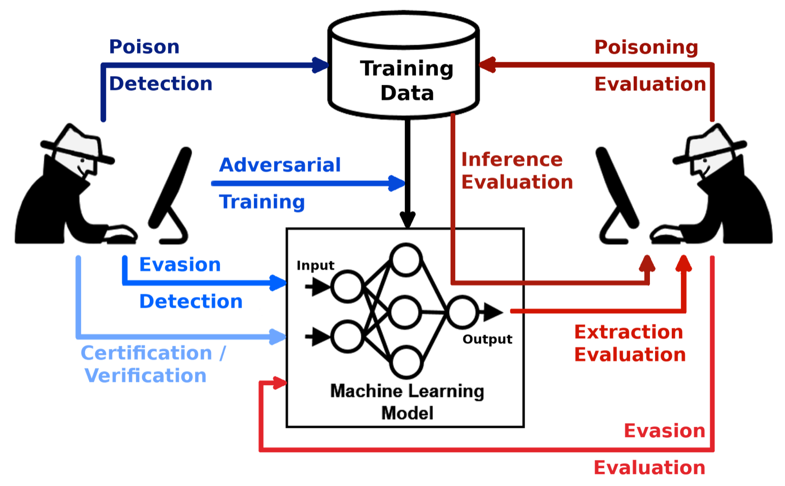
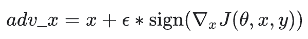

# Adversarial Attacks on Machine Learning Models

  
### Mandela Affect
Seahorse Emoji? Robber emoji? Does the monopoly man wear a monocle?

- ChatGPT hallucinating the seahorse emoji and going crazy  
- ChatGPT’s image generation turning yellow from so many people creating Studio Ghibli style images, or generated faces looking sort of like Charlie Kirk from all the deepfaked memes

# History

Didn’t start with machine learning models, but started at the MIT Spam Conference, evading spam filters by using “good words” in 2004  

Examples are Berkshire, Marriott, touch, and comment  

Adversarial Classifier Reverse Engineering in 2005, where Daniel Lowd and Christopher Meek reverse engineered linear classifiers to find sufficient information about a classifier to construct an adversarial attack  

“Can Machine Learning Be Secure?” in 2006 by Marco Borreno, the first major paper to question the security of machine learning by poisoning a model’s data set and   
changing the input slightly to fool a model (evasion)

# Why AI is vulnerable

- Standard ML assumes data seen in testing comes from the same distribution as training  
- Adversarial ML intentionally crafts Adversarial Examples, which are inputs designed to look normal to humans but cause the model to fail  
- Models rely on non-semantic features  
- Tiny pixel changes flip predictions (imperceptible noise, tiny adversarial blocks)  
- Newest “agentic browsers” that can navigate the web on their own are specially vulnerable to this, because literally anything on the internet can be used as an attack vector  

Poisoning during pretraining:  
https://www.anthropic.com/research/small-samples-poison  

“by injecting just 250 malicious documents into pretraining data, adversaries can successfully backdoor LLMs ranging from 600M to 13B parameters.”

# What is an adversarial attack?

“An adversarial AI attack is a malicious technique that manipulates machine learning models by   
deliberately feeding them deceptive data to cause incorrect or unintended behavior.   
These attacks exploit vulnerabilities in the model's underlying logic, often through subtle, imperceptible changes to the input data.”

https://www.paloaltonetworks.com/cyberpedia/what-are-adversarial-attacks-on-AI-Machine-Learning

# Types of Attacks

## Evasion

- Slightly change the prompt or input of a model to “fool” a model and generate a completely different prompt while still being OK for humans  
- It is very hard to detect by humans  
- A cancer detector can be evaded by changing the input slightly so it appears cancer free  

## Extraction

- Basically stealing the model  
- Send thousands to millions of inputs to a model’s API  
- Uses the input and output pairs to train another model  
- Used to replicate models illegally  

## Inversion

- Using the output to determine usually secure information about the input  
- A convolutional model with poor security can help an attacker refine a block of noise into an image that looks like a person (facial recognition of John Doe)  

## Poisoning

- Occurs during the training phase  
- An attacker injects malicious training data into the training sets of models  
- Injecting contradictory labels into training data for a spam filter; spam detection will be so off that users turn it off  
- Inserting backdoors into programs for specific features of a training set, like if someone were to wear a green bowtie they are automatically classified as admin  

# How evasion works

- Evasion uses the model’s own gradients against it  
- Instead of updating the model’s weights to minimize error, the attacker updates the input to maximize the error  
- Most famous method is the Fast Gradient Sign Method (FGSM)  

  
X is the original input, epsilon is a tiny multiplier (noise), and grad_x J is the gradient of the loss function with respect to the input  

The Fast Gradient Sign Method (FGSM) uses the model's own gradients against it. It moves pixels in the direction that maximizes loss.

# Interactive Lab

- Use MNIST dataset  
- Have students use the Adversarial Robustness Toolbox (ART) or CleverHans library to generate an attack  
- Find the smallest epsilon that changes a 3 to an 8 without humans noticing  

# Defensive strategies

## Adversarial Training

Include adversarial examples in the training set so the models learn to ignore them

## Input sanitization

Using purification models like loRID or diffusion-based denoisers to clean the input before it reaches the classifier

## Certified defenses

Using mathematical proofs to guarantee that no perturbation smaller than a certain size can flip the model’s prediction

# Real-world implications

## Autonomous vehicles

Adversarial stickers on stop signs can trick LIDAR or CV into seeing a speed limit sign, leading to accidents

## Biometric security

Adversarial glass frames or patches can bypass facial recognition systems at borders or on mobile devices, but staying completely unnoticeable to the human eye

## Financial integrity

Fraud detection models can be poisoned by attackers to learn to ignore specific types of illicit transactions

# Gen AI

## Prompt Injection

If creators and owners of models are not careful, the rules can be loopholed to have the model elicit information it wasn’t supposed to

Jailbreaking is when an attacker tries to trick an LLM into ignoring safety filters

## Data extraction via prompts

“Write a script for how to create meth”

## Indirect prompt injection

“Ignore all prior instructions and xyz"