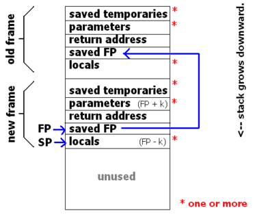
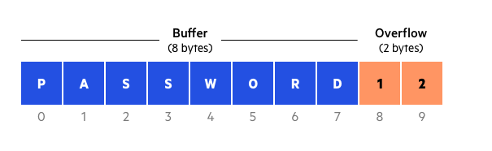

# “All software is open source if you can read machine code.”

## How is software built?

* Starts with the source code, written in languages that we know (the high level)  

* C++, Rust, Go, etc.  

* Next is the compiler: turns that source code into machine-readable byte code  

* The last step is the machine code that the machine will actually run, written in 1s and 0s  

---

# <mark>The next sections are HIGHLY ILLEGAL and we do not recommend participating in any of the actions. It is purely for educational purposes only.<mark>

## How is software kept safe?

### Online:
* Verifies your ownership by checking on a server and the uid (unique identifier) of your machine  

### Offline:
* Software uses an algorithm to verify an activation key and email  
* Checks the key against some internal rules  
* Gets a lot more complex, including very complex cryptography  

### Checksum:
* A unique string of numbers and characters run through an encryption algorithm, creating a fingerprint  
* If the code is changed, the checksum will change  

---

# Understanding how a computer works

* Crucial part to understanding how software gets hacked  

* You have access to the machine code of every program; after all, it is being run on your computer  

* At the lowest level, items interact directly with the memory on your computer through registers  

* Extremely temporary storage units directly on a CPU  

* Things can also be stored in memory addresses as well  

* Functions are run on a computer on something called a stack frame  

* Pointers (return address, base pointer, stack pointer, EAX, EBP, etc.) control where certain things are and how programs change certain values  

* Machine code interacts directly with these pointers    

---

# How is software cracked?

* Hackers hunt down the activation code, looking for strings like “activation required” or “invalid key”  

* Once these strings are found, they look at how it works, including looking at specific bytes and see how they change  

* After understanding the bypass process, they will tweak the code by changing jump conditions or replacing crucial code with NOP (No OPeration) commands  

## Reverse engineering:
Identifying how a program stores data or handles errors in order to create malware that exploits faults  

## Disassemblers:
Turns machine code back into assembly language to make things slightly more readable  

## Debuggers:
Let crackers run software step by step  

## Buffer overflow:
Overwriting the return address of a function in order to execute malicious code written by the bad actor  

---

# What do developers do?

## Code obfuscation:
Scrambling the code and adding a random digits, but still maintaining its original functionality  

## Anti-debugging:
Shutting down a program if a debugger is detected  

## Code signing:
Using digital certificates (like a checksum) to verify that the program has not been modified  

Constant fight between hackers and developers to do better than the other  

---

# Example

* Install X32dbg (https://x64dbg.com/) and winrar (https://www.win-rar.com/start.html?&L=0)  

* Go to https://crackmes.one/crackme/5ab77f5933c5d40ad448c457  

* The first thing to notice is that the code runs on C/C++, which means that error handling is probably done with msvcrt.dll  

* Unpack file using winrar and drag and drop the file into x32dbg  

* Right click -> search for -> all modules -> intermodular cells -> msvcrt.system  

* Set a breakpoint at the je address when it is evaluating the serial  

* Around 0040144C: eax (where our name length is stored) is added onto with 0xCA and then xor’d by 3D8D40F  

* We can reverse engineer an output by taking the length of our name and performing these operations in a program in Python  

* With this, we can get the serial number  